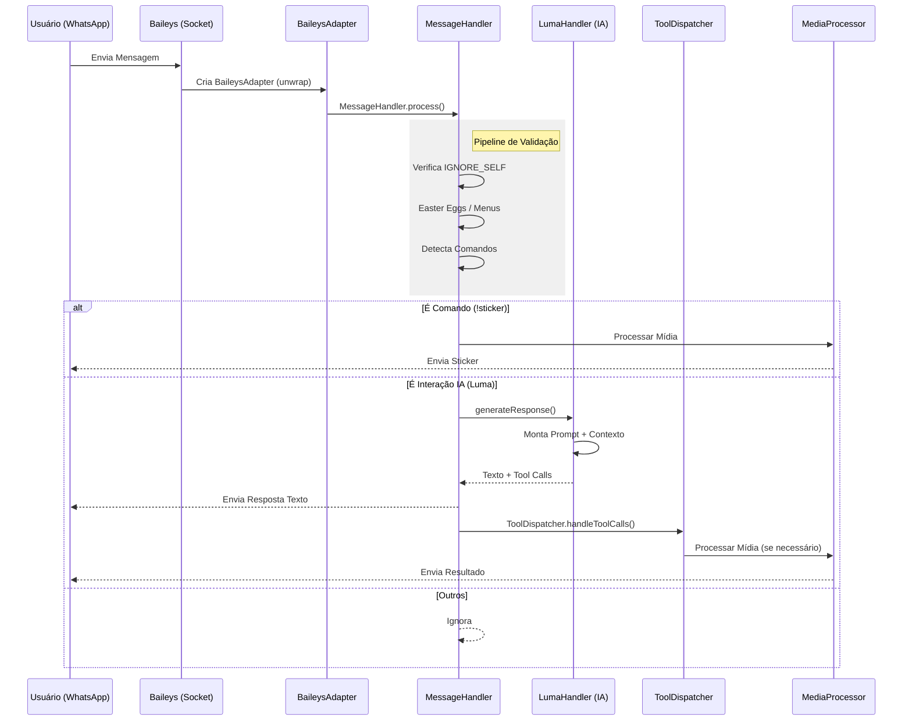

# 🏛️ Arquitetura do Sistema

O LumaBot foi desenhado para ser modular. Cada arquivo tem uma única responsabilidade.

## 🔄 Fluxo de Processamento (Pipeline)

O diagrama abaixo ilustra o que acontece quando o bot recebe uma mensagem (`messages.upsert`).



## 🧩 Organização de Código (Design Patterns)

### 1. Handlers (Controladores)

Localizados em `src/handlers/`. Atuam como **Controladores**. Eles recebem a entrada bruta, decidem quem deve processar e retornam a saída.

**Exemplo:** `MessageHandler.js` não sabe criar figurinhas; ele sabe que deve pedir ao `MediaProcessor` para criar uma.

```javascript
// src/handlers/MessageHandler.js (Simplificado)
class MessageHandler {
    async process(bot) {
        // 1. Validação
        if (CONFIG.IGNORE_SELF && bot.isFromMe) return;
        
        // 2. Roteamento
        const command = this.detectCommand(bot.body);
        if (command) {
            await this._executeExplicitCommand(bot, command);
        } else if (LumaHandler.isTriggered(bot.body)) {
            const response = await LumaHandler.generateResponse(...);
            // 3. Despacho de ferramentas da IA
            await ToolDispatcher.handleToolCalls(bot, response.toolCalls);
        }
    }
}
```

**Responsabilidades:**
- ✅ Validar entrada
- ✅ Normalizar estrutura de dados
- ✅ Rotear para o processador correto
- ❌ NÃO processa lógica de negócio
- ❌ NÃO acessa diretamente APIs externas

### 2. Processors (Workers)

Localizados em `src/processors/`. Executam o trabalho pesado e computacional. Não sabem sobre "WhatsApp" ou "Mensagens", apenas sobre "Bytes" e "Arquivos".

**Exemplo:** `ImageProcessor.js` recebe um Buffer e devolve um Buffer WebP. Ele não envia a mensagem.

```javascript
// src/processors/ImageProcessor.js (Simplificado)
class ImageProcessor {
    async createSticker(imageBuffer) {
        // 1. Redimensiona para 512x512
        const resized = await sharp(imageBuffer)
            .resize(512, 512, { fit: 'cover' })
            .webp({ quality: 80 })
            .toBuffer();
        
        // 2. Adiciona metadados Exif
        const withExif = await this.addExifMetadata(resized);
        
        return withExif;
    }
    
    // Este método NÃO sabe o que é "sock.sendMessage"
    // Ele apenas transforma bytes
}
```

**Responsabilidades:**
- ✅ Transformar dados (imagem, áudio, vídeo)
- ✅ Executar algoritmos computacionalmente intensivos
- ✅ Retornar dados processados
- ❌ NÃO envia mensagens do WhatsApp
- ❌ NÃO acessa banco de dados

### 3. Managers (Gerenciadores de Estado)

Localizados em `src/managers/`. Mantêm o estado da aplicação que precisa persistir durante a execução ou ser acessado globalmente.

**Exemplo:** `ConnectionManager.js` segura a conexão do socket.

```javascript
// src/managers/ConnectionManager.js (Simplificado)
class ConnectionManager {
    constructor() {
        this.sock = null;
        this.reconnectAttempts = 0;
        this.maxReconnectAttempts = 3;
    }
    
    async initialize() {
        this.sock = await this.createConnection();
        this.setupEventListeners();
        this.startHealthCheck();
    }
    
    getSock() {
        if (!this.sock) throw new Error('Socket não inicializado');
        return this.sock;
    }
    
    async handleDisconnection(reason) {
        if (reason.statusCode === 401) {
            // Desautenticado - precisa novo QR
            await this.cleanup();
            await this.initialize();
        } else {
            // Erro temporário - tenta reconectar
            await this.reconnect();
        }
    }
}
```

**Responsabilidades:**
- ✅ Manter estado global (socket, configurações)
- ✅ Gerenciar ciclo de vida de conexões
- ✅ Implementar retry logic
- ❌ NÃO processa mensagens diretamente
- ❌ NÃO contém lógica de negócio

### 4. Services (Camada de Dados)

Localizados em `src/services/`. Abstraem o acesso ao banco de dados ou APIs externas.

**Exemplo:** `DatabaseService.js` esconde o SQL do resto do código.

```javascript
// src/services/DatabaseService.js (Simplificado)
class DatabaseService {
    static incrementMetric(key) {
        const stmt = dbMetrics.prepare(`
            INSERT INTO metrics (key, value) VALUES (?, 1)
            ON CONFLICT(key) DO UPDATE SET value = value + 1
        `);
        stmt.run(key);
    }
    
    static getPersonality(jid) {
        const stmt = dbPrivate.prepare(`
            SELECT personality FROM chat_settings WHERE jid = ?
        `);
        return stmt.get(jid)?.personality || 'default';
    }
    
    // O resto do código não precisa saber SQL
}
```

**Responsabilidades:**
- ✅ Abstrair acesso a dados
- ✅ Implementar queries complexas
- ✅ Validar dados antes de persistir
- ❌ NÃO contém lógica de apresentação
- ❌ NÃO conhece o formato de mensagens do WhatsApp

## 📊 Diagrama de Dependências

```
┌─────────────────────────────────────────────────┐
│                   index.js                      │
│            (Ponto de Entrada)                   │
└────────────────┬────────────────────────────────┘
                 │
        ┌────────┴────────┐
        │                 │
┌───────▼─────┐   ┌──────▼────────┐
│ Connection  │   │   Message     │
│  Manager    │   │   Handler     │
└─────────────┘   └───────┬───────┘
                          │
        ┌─────────────────┼──────────────────┐
        │                 │                  │
┌───────▼─────┐  ┌────────▼──────┐  ┌────────▼──────┐
│   Luma      │  │    Media      │  │    Tool       │
│  Handler    │  │  Processor    │  │  Dispatcher   │
└──────┬──────┘  └───────┬───────┘  └───────────────┘
       │                 │
       │         ┌───────┴──────┐
       │         │              │
   ┌───▼────┐ ┌──▼──────┐ ┌────▼─────┐
   │  AI    │ │ Image   │ │ Video    │
   │Service │ │Processor│ │Converter │
   └────────┘ └─────────┘ └──────────┘
```

## 🔀 Fluxo de Dados Detalhado

### Cenário 1: Usuário envia texto "Oi Luma"

```
1. WhatsApp → Baileys emite evento "messages.upsert"
2. index.js captura e chama MessageHandler.process()
3. MessageHandler valida e normaliza
4. MessageHandler detecta: "não é comando, é mensagem normal"
5. MessageHandler chama LumaHandler.generateResponse()
6. LumaHandler:
   a. Busca histórico da conversa (DatabaseService)
   b. Busca personalidade configurada (DatabaseService)
   c. Monta prompt completo
   d. Chama API Gemini
   e. Salva resposta no histórico
7. LumaHandler retorna texto
8. MessageHandler envia via sock.sendMessage()
9. DatabaseService.incrementMetric('messages_sent')
```

### Cenário 2: Usuário envia imagem com legenda "!sticker"

```
1. WhatsApp → Baileys emite "messages.upsert"
2. index.js → MessageHandler.process()
3. MessageHandler detecta: "é comando !sticker com mídia"
4. MessageHandler chama MediaProcessor.createStickerFromImage()
5. MediaProcessor:
   a. Baixa imagem (Baileys downloadMediaMessage)
   b. Chama ImageProcessor.createSticker()
6. ImageProcessor:
   a. Redimensiona com Sharp (512x512)
   b. Converte para WebP
   c. Adiciona metadados Exif
   d. Retorna Buffer
7. MediaProcessor retorna sticker pronto
8. MessageHandler envia via sock.sendMessage()
9. DatabaseService.incrementMetric('stickers_created')
```

## 🛡️ Camadas de Segurança

### Validação em Múltiplos Níveis

```javascript
// Camada 1: Handler valida estrutura
if (!msg.key || !msg.message) return;

// Camada 2: Handler valida origem
if (msg.key.fromMe && IGNORE_SELF) return;

// Camada 3: Adapter desempacota protocolos (ephemeral, viewOnce)
const msg = BaileysAdapter.unwrapMessage(message);

// Camada 4: Processor valida dados
if (Buffer.byteLength(mediaBuffer) > MAX_SIZE) throw Error;

// Camada 5: ToolDispatcher valida permissões (admin check)
if (!senderIsAdmin) return reply("Sem permissão");
```

## 🔧 Padrões de Configuração

### Configurações Estáticas vs Dinâmicas

**Estáticas** (config/lumaConfig.js):
- Personalidades da Luma
- Limites de tamanho de arquivo
- Prompts base

**Dinâmicas** (Banco de Dados):
- Personalidade por grupo
- Histórico de conversas

```javascript
// Exemplo de como elas se combinam:
const basePersonality = lumaConfig.personalities.default;
const groupPersonality = DatabaseService.getPersonality(groupJID);

const finalPrompt = `${basePersonality}\n\n${groupPersonality}`;
```

## 📈 Monitoramento e Métricas

O sistema coleta automaticamente:

- Total de mensagens processadas
- Total de stickers criados
- Taxa de erro de conversões
- Tempo de resposta da IA
- Quantidade de reconexões

Tudo armazenado em `luma_metrics.sqlite` para análise posterior.

## 🚀 Otimizações Arquiteturais

### 1. Lazy Loading
Processadores pesados (FFmpeg, Sharp) só são carregados quando necessários.

### 2. Pooling de Conexões
O socket do Baileys é reutilizado para todas as mensagens, evitando overhead de reconexão.

### 3. Cache de Respostas
Histórico de conversas fica em memória RAM, evitando queries desnecessárias ao banco.

### 4. Async Everywhere
Todas as operações I/O são assíncronas, mantendo o event loop livre.

---

**Próximo passo**: Entenda como a IA funciona em [02-nucleo-ia.md](./02-nucleo-ia.md)